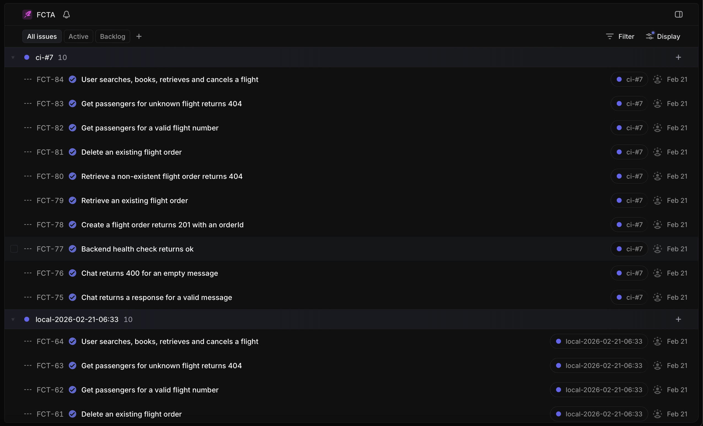

# Flight Booking Automation Showcase

> ⚠️ **Start from the boilerplate branch, not main.**
> `main` contains the fully built project. If you want to build this step by step as a learning exercise, switch to the `boilerplate` branch which has the folder structure scaffolded but all implementation files empty.
> ```bash
> git checkout boilerplate
> ```

## 1. Project Overview
Flight Booking Automation Showcase — a full-stack AI-powered flight booking chatbot built as a QA portfolio project. Demonstrates end-to-end software delivery: from backend API development to mobile frontend to test automation pipeline.

## 2. Architecture Diagram
The architecture diagram is available in [docs/ARCHITECTURE.md](docs/ARCHITECTURE.md). It shows all layers: Mobile (Expo) → Backend (Express) → Gemini AI + Amadeus API + Mock Services → MongoDB Atlas.

## 3. Tech Stack Table
| Layer | Technology |
|---|---|
| Mobile | React Native + Expo |
| Backend | Node.js + Express.js |
| Database | MongoDB Atlas (Mongoose) |
| AI | Google Gemini (function calling) |
| Flight Data | Amadeus Travel API |
| Auth | Passport.js + JWT |
| Mock Services | Express.js + MongoDB |
| Testing | Cucumber.js + Axios + Allure |
| CI/CD | GitHub Actions |
| Test Reporting | Allure + GitHub Pages |
| Project Tracking | Linear |
| Deployment | Vercel |

> **Note:** This project was developed with the assistance of the Claude and Gemini CLIs.

## 4. How We Built This (Step by Step)

This project was built layer by layer, following a structured development process.

**Step 1 — Project Setup**
- Initialized Git repo, defined folder structure: `backend/`, `mock-services/`, `frontend/`, `automation/`, `docs/`
- Set up Node.js environment (v20+), installed dependencies per service
- Created MongoDB Atlas cluster, set up network access and database user

**Step 2 — Backend (Express.js API)**
- Initialized Express server on port 3000
- Connected MongoDB Atlas via Mongoose
- Built health check endpoint (`GET /api/health`)
- Integrated Amadeus SDK — flight search endpoint (`GET /api/flights/search`)
- Added security middleware: helmet, hpp, express-rate-limit
- Added CORS configuration

**Step 3 — Authentication**
- Built User model with Mongoose (email, password, role: user/agent)
- Added bcrypt password hashing via pre-save hook
- Implemented Passport.js JWT strategy
- Built auth endpoints: `POST /api/auth/signup` + `POST /api/auth/login`
- JWT payload: `{ id, role }` — 7-day expiry
- Added `requireAuth` + `requireRole('agent')` middleware

**Step 4 — Gemini AI Integration**
- Integrated Google Gemini SDK with function calling
- Defined 4 tools: search_flights, retrieve_booking, cancel_booking, get_passengers
- Built execution loop (max 5 iterations) in `llmService.js`
- Built `toolExecutors.js` — HTTP calls to backend + mock-service endpoints
- Added dynamic system prompt with current date
- Built chat endpoint: `POST /api/chat` (protected by requireAuth)
- Added chat-specific rate limiting: 20 req/1 minute

**Step 5 — Mock Services**
- Built separate Express server on port 3001 for airline operations simulation
- Studied real Amadeus API response shapes (captured in `docs/`)
- Built 4 mock endpoints for booking and passenger services
- Protected all routes with a service-to-service API key (`x-service-key` header)
- Migrated from in-memory storage to MongoDB Atlas
- Built idempotent seed script for test data

**Step 6 — Frontend (React Native + Expo)**
- Scaffolded Expo project
- Built chat screen UI wired to `POST /api/chat`
- Added loading animation and disabled send button during bot reply

**Step 7 — Deployment (Vercel)**
- Added `vercel.json` to backend + mock-services
- Deployed backend and mock-services to Vercel
- Set all environment variables in Vercel dashboard
- Updated CORS to lock down to production frontend domain
- Set MongoDB Atlas network access to allow all IPs

**Step 8 — Test Automation (Cucumber.js)**
- Scaffolded `automation/` folder with Cucumber.js + Axios + Allure
- Wrote BDD feature files for API contracts and E2E flows
- Implemented step definitions and helper functions
- Added tagging conventions (`@local`, `@wip`) for targeted test execution

**Step 9 — Allure Reporting**
- Integrated allure-cucumberjs reporter
- Added `npm run report` + `npm run report:open` scripts
- Configured GitHub Actions to publish reports to GitHub Pages

**Step 10 — GitHub Actions CI/CD**
- Built a workflow to run tests on push/PR to main and on manual dispatch
- Included secrets for all required services

**Step 11 — Linear Integration**
- Chose a post-processing approach over a hooks-based one to mirror the AirAsia Xray CI pattern.
- Built `linearHelper.js` to handle GraphQL mutations with variables, preventing injection vulnerabilities.
- Created `cucumber-to-linear.js` script to read the `cucumber-report.json`, create tickets in Linear, and patch the Allure result JSON files.
- Implemented a `workflow_dispatch` boolean flag for on-demand ticket creation, so it doesn't run on every push.
- The Allure result patching adds a `links` array to the result JSON, which creates a direct link to the ticket in the Allure report.

## Linear Integration

This project uses [Linear](https://linear.app) for project tracking and automated ticket management, integrated directly into the CI/CD pipeline.

The integration follows a post-processing pattern:
1.  Tests are executed, generating a `cucumber-report.json` file.
2.  A script reads this report and creates a new ticket in Linear for each scenario.
3.  The ticket status is automatically updated based on the test result (e.g., "Done" for passed, "Cancelled" for failed).
4.  The generated Allure report is then automatically patched with a direct link to the corresponding Linear ticket for each test.



### How to Trigger

You can trigger this process manually in GitHub Actions:
1.  Go to the "Actions" tab and select the "Cucumber Tests" workflow.
2.  Click "Run workflow".
3.  Check the "Create Linear tickets" box before running.

### Label Convention

Each test run is grouped in Linear using a unique label for easy filtering:
-   **CI Runs:** `ci-#N` (e.g., `ci-#12`)
-   **Local Runs:** `local-YYYY-MM-DD-HH:MM`

This integration provides seamless traceability from test execution to project management. You can find a direct link to the Linear ticket within the "Links" section of each test in the Allure report.

## 5. Local Setup Guide

**Prerequisites:**
- Node.js v20+, npm, Git, Expo CLI (`npm install -g expo-cli`)
- MongoDB Atlas account
- Amadeus developer account (free test tier)
- Google AI Studio account (Gemini API key)

**Clone and install:**
```bash
git clone https://github.com/adggalman/flightChatbot.git
cd flightChatbot
cd backend && npm install
cd ../mock-services && npm install
cd ../automation && npm install
```

**Environment variables** — create `.env` in each service (never commit these):

`backend/.env`:
```
MONGODB_URI=
JWT_SECRET=
AMADEUS_CLIENT_ID=
AMADEUS_CLIENT_SECRET=
GEMINI_API_KEY=
MOCK_SERVICE_URL=http://localhost:3001
SERVICE_API_KEY=
```

`mock-services/.env`:
```
MONGODB_URI=
SERVICE_API_KEY=
```

`automation/.env`:
```
BACKEND_URL=http://localhost:3000
MOCK_SERVICE_URL=http://localhost:3001
SERVICE_API_KEY=
```

**Run locally:**
```bash
# Terminal 1 — backend
cd backend && npm run dev

# Terminal 2 — mock services
cd mock-services && npm run dev

# Terminal 3 — frontend
cd frontend && npx expo start
```

**Run tests:**
```bash
cd automation
npm test                    # all tests (excludes @local)
npm run test:api            # api-contracts only
npm run test:flows          # happy-path flow only
npx cucumber-js --tags '@wip'   # work in progress only
npx cucumber-js --profile local  # all including @local (run against localhost)
```

## 6. Live Links
- **Allure Test Report:** https://adggalman.github.io/flightChatbot/
- **Backend API:** https://flightchatbot.vercel.app
- **Mock Services:** https://mock-services-beta.vercel.app

## 7. QA Showcase Highlights
- BDD feature files (Gherkin) — API contracts + E2E happy-path flow
- Reusable step definitions with generic status/body assertions
- Auto-cleanup of test data via Cucumber After hooks (prevents DB pollution)
- On-demand Linear ticket creation + auto status update via GraphQL API
- Allure ↔ Linear bidirectional linking (test report links to ticket, ticket links to report)
- Run-labeled grouping in Linear (each CI run gets its own label)
- Environment-aware tagging (`@local`, `@wip`) — rate-limit test excluded from CI
- Allure report published to GitHub Pages on every CI push

## 8. Additional Setup Information

### MongoDB Atlas Setup:
1. Create a free cluster at cloud.mongodb.com.
2. Create a database user (username + password).
3. Set Network Access → `0.0.0.0/0` (required for Vercel dynamic IPs).
4. Get connection string: Clusters → Connect → Drivers → copy URI.
5. Replace `<password>` in the URI with your database user password.

### Amadeus API Credentials:
1. Sign up at developer.amadeus.com.
2. Create a new app and copy the `API Key` (AMADEUS_CLIENT_ID) and `API Secret` (AMADEUS_CLIENT_SECRET).

### Gemini API Key:
1. Go to aistudio.google.com and create an API key.

### Vercel Deployment:
1. Run `vercel --prod` from the `backend` and `mock-services` directories.
2. Set all environment variables in the Vercel dashboard for each project.
